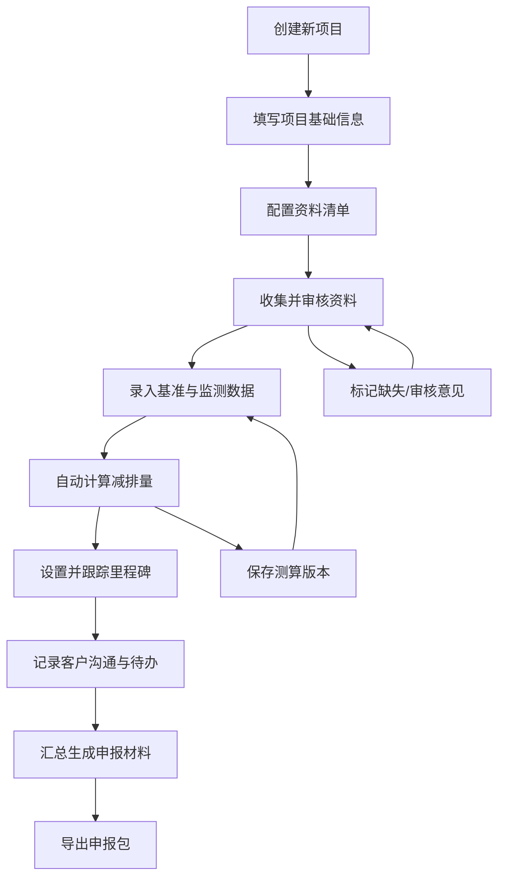

## 1. 产品概述

碳减排项目申报管理系统，为咨询机构提供一站式的客户碳减排项目全流程管理平台。系统覆盖从项目立项、资料收集、减排测算、里程碑跟踪、客户沟通到最终申报包生成的完整业务链条，帮助顾问高效管理多个客户项目，提升申报成功率和服务质量。

### 产品价值
- 集中管理多客户、多项目的申报材料
- 标准化资料清单与审核流程，减少遗漏
- 自动化减排量测算，提高效率与准确性
- 可视化项目进度与里程碑，便于跟踪
- 完整的沟通记录与待办事项，保障信息不丢失
- 一键生成规范的申报材料包

## 2. 核心功能

### 2.1 用户角色

| 角色 | 注册方式 | 核心权限 |
|------|----------|----------|
| 顾问用户 | 系统内置账户 | 创建/编辑项目、上传资料、测算减排量、管理里程碑、记录沟通、生成申报包 |

### 2.2 功能模块

1. **项目总览页**：项目列表、关键指标统计、快捷操作入口
2. **客户项目详情页**：项目基础信息编辑、项目类型/边界/建设时间/减排来源配置
3. **资料清单页**：资料分类清单、上传/缺失标记、审核意见记录
4. **减排量测算页**：基准值录入、监测值录入、减排量自动计算、测算结果展示
5. **里程碑管理页**：立项/监测/核查/签发节点设置、进度跟踪、完成状态标记
6. **沟通记录页**：客户沟通记录、待办事项、问题追踪
7. **申报包页面**：申报材料目录、进度报告、问题清单、一键汇总导出

### 2.3 页面详情

| 页面名称 | 模块名称 | 功能描述 |
|----------|----------|----------|
| 项目总览页 | 统计卡片 | 展示项目总数、进行中项目、待处理资料、待办事项等关键指标 |
| 项目总览页 | 项目列表 | 展示所有客户项目，支持搜索、筛选、状态标签，点击进入详情 |
| 项目总览页 | 快速创建 | 悬浮按钮快速创建新项目 |
| 客户项目详情页 | 基础信息表单 | 项目名称、客户名称、项目类型、项目边界、建设时间、预期减排来源 |
| 资料清单页 | 分类清单 | 合同、发票、监测记录、现场照片四大类资料列表 |
| 资料清单页 | 资料操作 | 上传文件、标记缺失、填写审核意见、状态标记（待审核/通过/驳回） |
| 减排量测算页 | 基准数据录入 | 基准年份、基准能耗、基准排放因子等数据录入 |
| 减排量测算页 | 监测数据录入 | 监测周期、实际能耗、实际排放因子等数据录入 |
| 减排量测算页 | 测算结果 | 自动计算减排量，展示计算公式与明细，支持版本保存 |
| 里程碑管理页 | 节点时间轴 | 立项、监测、核查、签发四大关键节点可视化时间轴 |
| 里程碑管理页 | 节点管理 | 设置计划/实际完成时间、责任人、备注、完成状态切换 |
| 沟通记录页 | 沟通历史 | 时间线展示沟通记录，支持添加文字、附件 |
| 沟通记录页 | 待办事项 | 创建待办任务、设置截止日期、标记完成状态 |
| 申报包页面 | 材料目录 | 自动汇总已收集资料，生成结构化申报目录 |
| 申报包页面 | 进度报告 | 汇总项目各模块完成度，生成进度报告 |
| 申报包页面 | 问题清单 | 汇总所有审核意见、待处理问题，支持导出 |

## 3. 核心流程

顾问从创建项目开始，依次完成项目基础信息填写、资料收集与审核、减排量测算、里程碑跟踪、客户沟通记录，最终汇总生成申报包。

## 4. 用户界面设计

### 4.1 设计风格

- **主色调**：深绿色系（#0F766E 主色），体现环保与可持续发展主题
- **辅助色**：暖金色（#D97706）用于强调与状态提示
- **中性色**：浅灰（#F8FAFC）背景、深灰（#1E293B）文字
- **按钮风格**：圆角矩形（rounded-lg），悬停有微阴影过渡
- **字体**：标题使用 "Noto Sans SC"，正文使用系统无衬线字体
- **布局风格**：侧边导航 + 顶部栏 + 内容卡片式布局
- **图标风格**：Lucide 线性图标，保持简洁专业

### 4.2 页面设计概述

| 页面名称 | 模块名称 | UI 元素 |
|----------|----------|---------|
| 项目总览页 | 统计卡片 | 渐变背景卡片、数值动画、图标装饰、悬停上浮效果 |
| 项目总览页 | 项目列表 | 卡片网格布局、状态标签、进度条、客户名称标识 |
| 客户项目详情页 | 表单区块 | 分组表单、标签分组、输入框聚焦动效 |
| 资料清单页 | 资料分类 | Tab 切换、文件上传拖拽区、状态徽章、审核意见气泡 |
| 减排量测算页 | 数据表格 | 可编辑单元格、实时计算高亮、公式说明提示框 |
| 里程碑管理页 | 时间轴 | 垂直时间轴、节点连接线、完成状态对勾动画 |
| 沟通记录页 | 时间线 | 左右交替时间线、聊天气泡样式、待办卡片勾选 |
| 申报包页面 | 汇总面板 | 折叠式目录树、进度环形图、问题标签云、导出按钮组 |

### 4.3 响应式设计

- 采用桌面优先设计（Desktop-first）
- 侧边导航在平板尺寸折叠为图标模式
- 移动端底部导航替代侧边导航
- 表格支持横向滚动
- 触摸操作优化：按钮最小高度 44px

### 4.4 动效与交互

- 页面加载：卡片渐入 + 轻微向上位移（staggered 动画）
- 状态切换：平滑过渡动画（0.3s ease）
- 文件上传：拖拽区高亮反馈
- 数据更新：数值滚动动画
- 里程碑完成：对勾绘制动画
