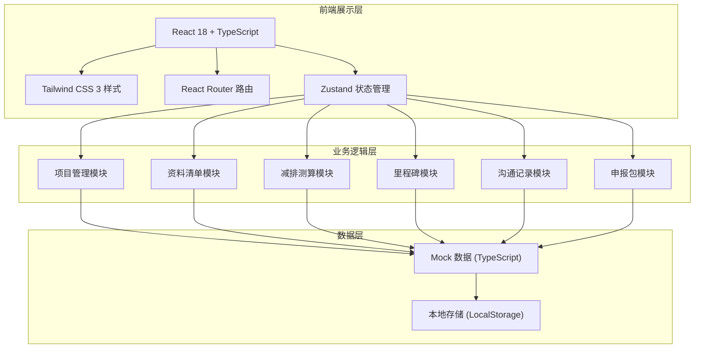
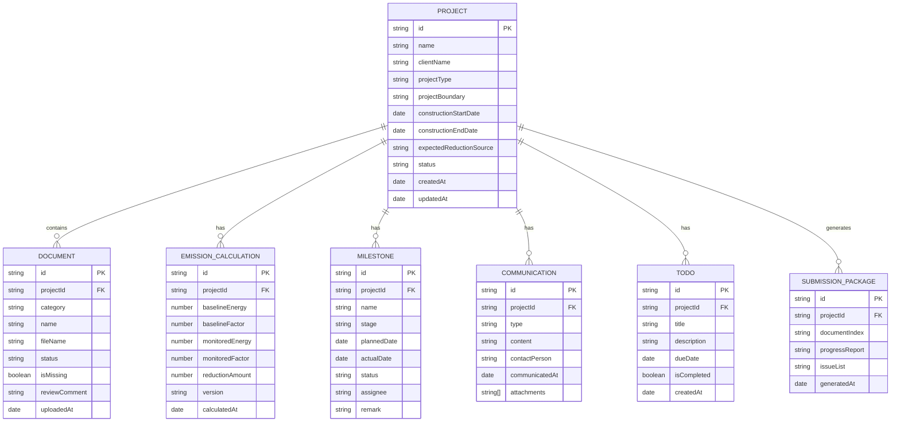

## 1. 架构设计



## 2. 技术描述

- **前端框架**：React 18 + TypeScript
- **构建工具**：Vite
- **样式方案**：Tailwind CSS 3
- **路由管理**：React Router DOM v6
- **状态管理**：Zustand
- **图标库**：Lucide React
- **后端服务**：无（纯前端应用，使用 Mock 数据）
- **数据持久化**：LocalStorage

## 3. 路由定义

| 路由路径 | 页面用途 |
|----------|----------|
| `/` | 项目总览页，展示项目列表与关键统计指标 |
| `/projects/:id` | 客户项目详情页，编辑项目基础信息 |
| `/projects/:id/documents` | 资料清单页，管理合同、发票、监测记录、现场照片 |
| `/projects/:id/calculation` | 减排量测算页，录入基准值与监测值并计算减排量 |
| `/projects/:id/milestones` | 里程碑管理页，设置与跟踪项目关键节点 |
| `/projects/:id/communications` | 沟通记录页，管理客户沟通与待办事项 |
| `/projects/:id/submission` | 申报包页面，汇总材料与生成报告 |

## 4. 数据模型

### 4.1 数据模型定义



### 4.2 TypeScript 类型定义

```typescript
// 项目状态
type ProjectStatus = 'draft' | 'in_progress' | 'under_review' | 'submitted' | 'completed';

// 资料状态
type DocumentStatus = 'pending' | 'approved' | 'rejected';

// 资料分类
type DocumentCategory = 'contract' | 'invoice' | 'monitoring' | 'photo';

// 里程碑阶段
type MilestoneStage = 'initiation' | 'monitoring' | 'verification' | 'issuance';

// 里程碑状态
type MilestoneStatus = 'not_started' | 'in_progress' | 'completed' | 'delayed';

// 沟通类型
type CommunicationType = 'meeting' | 'phone' | 'email' | 'wechat';

// 项目基础信息
interface Project {
  id: string;
  name: string;
  clientName: string;
  projectType: string;
  projectBoundary: string;
  constructionStartDate: string;
  constructionEndDate: string;
  expectedReductionSource: string;
  status: ProjectStatus;
  createdAt: string;
  updatedAt: string;
}

// 资料清单
interface DocumentItem {
  id: string;
  projectId: string;
  category: DocumentCategory;
  name: string;
  fileName?: string;
  status: DocumentStatus;
  isMissing: boolean;
  reviewComment?: string;
  uploadedAt?: string;
}

// 减排量测算
interface EmissionCalculation {
  id: string;
  projectId: string;
  baselineYear: string;
  baselineEnergy: number;
  baselineFactor: number;
  monitoredPeriod: string;
  monitoredEnergy: number;
  monitoredFactor: number;
  reductionAmount: number;
  version: string;
  calculatedAt: string;
}

// 里程碑
interface Milestone {
  id: string;
  projectId: string;
  name: string;
  stage: MilestoneStage;
  plannedDate: string;
  actualDate?: string;
  status: MilestoneStatus;
  assignee: string;
  remark?: string;
}

// 沟通记录
interface Communication {
  id: string;
  projectId: string;
  type: CommunicationType;
  content: string;
  contactPerson: string;
  communicatedAt: string;
  attachments?: string[];
}

// 待办事项
interface TodoItem {
  id: string;
  projectId: string;
  title: string;
  description?: string;
  dueDate?: string;
  isCompleted: boolean;
  createdAt: string;
}
```

## 5. 目录结构

```
src/
├── components/           # 通用组件
│   ├── Layout/          # 布局组件
│   ├── Sidebar/         # 侧边导航
│   ├── ProjectCard/     # 项目卡片
│   ├── StatusBadge/     # 状态标签
│   ├── Timeline/        # 时间轴组件
│   └── ProgressRing/    # 环形进度
├── pages/               # 页面组件
│   ├── Dashboard/       # 项目总览页
│   ├── ProjectDetail/   # 项目详情页
│   ├── Documents/       # 资料清单页
│   ├── Calculation/     # 减排量测算页
│   ├── Milestones/      # 里程碑管理页
│   ├── Communications/  # 沟通记录页
│   └── Submission/      # 申报包页面
├── store/               # Zustand 状态管理
│   └── useProjectStore.ts
├── types/               # TypeScript 类型定义
│   └── index.ts
├── data/                # Mock 数据
│   └── mockData.ts
├── utils/               # 工具函数
│   ├── helpers.ts
│   └── constants.ts
├── App.tsx
├── main.tsx
└── index.css
```
